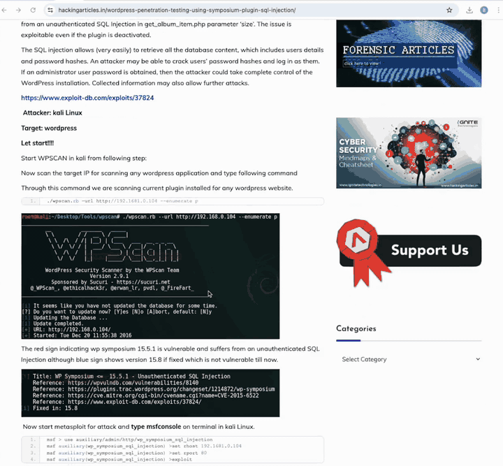

<p align="center">
  
</p>

# AI‑Assisted Pentest Report Generator


Generate polished, image‑rich penetration‑testing reports entirely offline from a handful of screenshots and a rough draft.

<sub>“Screenshots + draft → Porfiry → Ready‑to‑deliver Markdown”</sub>

> Note: This is an early alpha (concept) release. Expect rough edges; feedback is welcome.


## Features

- **Self‑hosted workflow.** Runs 100% locally — no data leaves your machine.
- **Markdown with inlined images (data:URI).** One self‑contained file; convenient for export to PDF/Word.
- **Full report generation.** Structured sections (Description / Evidence / Risk / Mitigation), plus Executive Summary and vulnerability statistics.
- **Out‑of‑the‑box templates.** Consistent client‑ready format driven by well‑tuned prompts.
- **Multimodal LLM chain.** Vision LLM for screenshots, optional OCR model for hard images.
- **Late‑fusion OCR.** Extract small UI text/logs via a dedicated OCR model and blend into the draft before generation.
- **AI assistant for edits.** Follow‑up prompts refine the generated report.
- **Local models via Ollama.** Works on CPU or GPU (NVIDIA / Apple Silicon via Metal) depending on your Ollama setup.


## Architecture

- Streamlit UI: `porfiry.py` — http://localhost:8501
- Report generator: `backend.py` (FastAPI) — http://127.0.0.1:8000
- OCR service: `ocr.py` (FastAPI) — http://127.0.0.1:8001
- Local LLM runtime: `ollama` — http://127.0.0.1:11434

All components are designed for fully offline operation.


## Requirements

| Backend         | Minimum Hardware Requirement |
|-----------------|------------------------------|
| **Apple Metal** | ≥M2 (pro) with ≥32 GB unified memory |
| **CUDA**        | ≥24 GB VRAM (e.g., NVIDIA RTX 3090) |
| **General**     | Capable of running the heaviest target model (e.g., Gemma3:27B requires ~17 GB VRAM) |

- Python 3.10+
- Ollama installed and models pulled:
  - `gemma3:27b` — report/kill‑chain generation (vision)
  - `benhaotang/Nanonets-OCR-s` — OCR for text‑heavy screenshots
- macOS / Linux / Windows

Install Ollama: `https://ollama.com/`

Pull models:
```bash
ollama pull gemma3:27b
ollama pull benhaotang/Nanonets-OCR-s
```


## Getting started (install + run)

Choose ONE path:

### Option A — One‑command start (macOS/Linux)
Runs everything in one terminal. Creates venv and installs dependencies automatically if missing.
```bash
chmod +x ./run-all.sh
./run-all.sh
```
UI: `http://localhost:8501`

Advanced:
- Skip auto‑install if everything is already set up: `NO_INSTALL=1 ./run-all.sh`
- Override ports: `PORT_API=8000 PORT_OCR=8001 PORT_UI=8501 ./run-all.sh`

### Option B — Manual setup and run
1) Clone and enter the project
```bash
git clone https://github.com/wadim1281/porfiry porfiry
cd porfiry
```

2) Create and activate virtualenv
```bash
python3 -m venv .venv
source .venv/bin/activate
```

3) Install dependencies
```bash
python -m pip install -U pip
pip install \
  fastapi uvicorn \
  streamlit streamlit-sortables streamlit-markdown streamlit-extras streamlit-draggable-list \
  requests httpx tinydb psutil ollama pillow pydantic
```
4) Start services
```bash
# 1) LLM API
uvicorn backend:app --host 127.0.0.1 --port 8000 --reload
# 2) OCR
uvicorn ocr:app        --host 127.0.0.1 --port 8001 --reload
# 3) UI
streamlit run porfiry.py --server.port 8501
```
Open `http://localhost:8501`.


## Configuration

Environment variables:
- Report generator `backend.py`:
  - `OLLAMA_HOST` (default `http://localhost:11434`) — Ollama endpoint
  - `OLLAMA_MODEL` (default `gemma3:27b`) — main VLM model
  - `LOGLEVEL` — logging level
- OCR service `ocr.py`:
  - `OLLAMA_URL` (default `http://localhost:11434`) — Ollama endpoint
- Streamlit UI `porfiry.py`:
  - `OLLAMA_URL` — used by the Markdown combiner’s Executive Summary generator
  - API endpoints are set in code:
    - `API_LL = "http://127.0.0.1:8000"`
    - `OCR_URL = "http://127.0.0.1:8001/ocr"`

Adjust if your services run on different hosts/ports.


## Using the UI

1. Go to the “REPORT GENERATOR” tab.
2. Enter the vulnerability name; put your notes into “Stream of thoughts.”
3. Upload screenshots (PNG/JPG) and reorder via drag‑and‑drop.
4. Click “Generate!” — tokens stream on the right; images are inlined as base64 in the final Markdown.
5. Use actions: Save, Download `.md`, or ask follow‑up questions to refine the output.
6. “MARKDOWN COMBINER” tab: upload multiple `.md`, merge, auto‑write Executive Summary or vulnerability statistics.

Saved reports are stored locally in `reports.json` (TinyDB).




## Use cases and workflows

Porfiry supports multiple paths depending on your input and the complexity of screenshots:

- **Single‑VLM (simple screenshots).**
  - Upload a few clear screenshots and a short draft. The vision LLM (`OLLAMA_MODEL`, e.g., `gemma3:27b`) reads the screenshots directly and produces a full report. Fastest path for obvious findings (panels, dialogs, URLs, simple logs).

- **OCR + VLM (complex screenshots).**
  - When screenshots contain tiny text, dense logs, or complicated terminal output, use the OCR modal (or the OCR buttons under each preview). The OCR service extracts text using a dedicated model (`benhaotang/Nanonets-OCR-s`). Insert the recognized text into your draft, then run generation — you get the best of both worlds: precise text + structured write‑up.

- **Text‑only (Obsidian lovers).**
  - No images? Paste your Markdown (links included) and let Porfiry structure it like a pro.

- **Hybrid.**
  - Mix and match: use screenshots where they speak for themselves; add OCR snippets for log‑heavy parts; paste text blocs for long narratives. Re‑run generation and use follow‑up prompts to iterate quickly.

